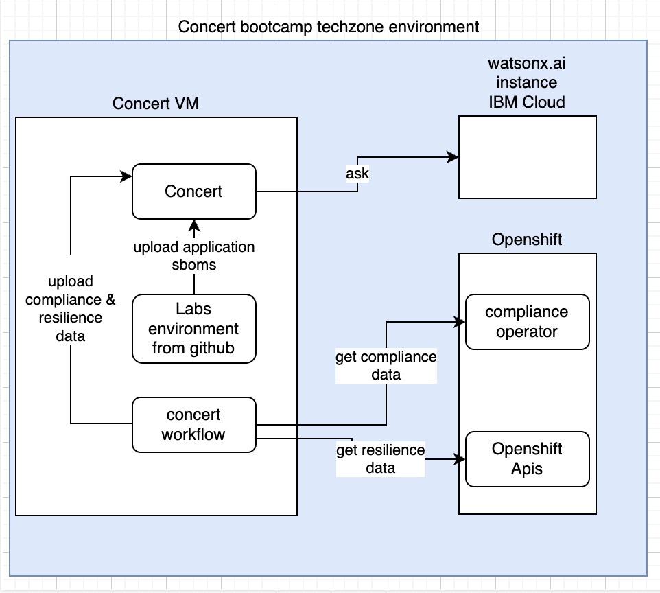

# ibm-concert-lab-guide

In this bootcamp, based on a simple python application composed of 2 micro services, you will learn to:

- [Lab0](labs/Lab0-setup.md) - Reserve required environment on techzone
- [Lab1](labs/Lab1a-concert-installation-vm.md) - Install IBM Concert
- [Lab3](labs/Lab3-concert-workflow-installation.md) - Install Concert Workflow
- [Lab4](labs/Lab4-managing-software-composition-and-cves.md) - Upload applications SBOMS in IBM Concert (application, build, deploy, code scan, image scan and vulnerability SBOMs)
- [Lab5](labs/Lab5-managing-operations-certificates.md) - Upload applications certificates in IBM Concert
- [Lab6](labs/Lab6-managing-compliance-using-concert-workflow.md) - Upload Openshift Compliance data in IBM Concert
- [Lab7](labs/Lab7-managing-resilience-using-concert-workflow.md) - Upload Openshift Resilience data in IBM Concert

In order to run the labs, you will provision on IBM Techzone some environments.   
Here is the architecture schema of your environment:

  