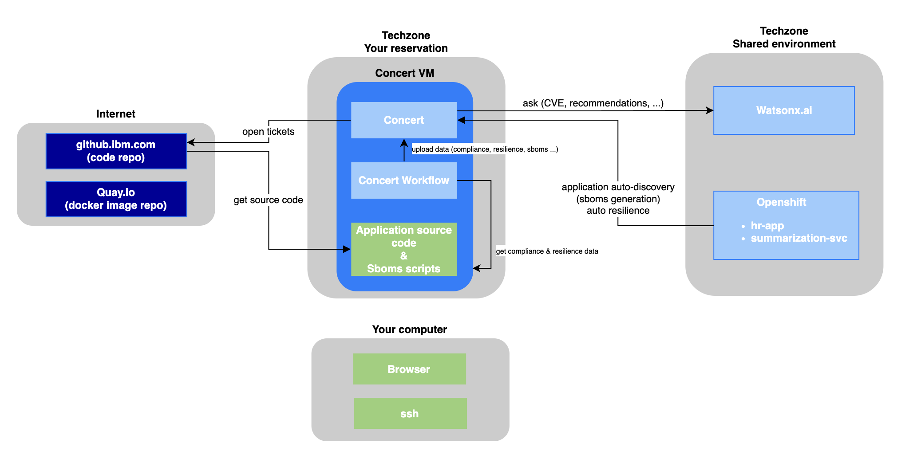

# IBM Concert Bootcamp v2.3.1

In this hands-on bootcamp, you will explore IBM Concert by working on a simple Python-based application composed of two microservices. Step by step, you will discover how to manage application health, risk, compliance, and resilience in a modern environment.

- [Lab0](labs/Lab0-Setup.md) - Reserve required environment on techzone
- [Lab1](labs/Lab1-concert-installation-vm.md) - Install IBM Concert
- [Lab2](labs/Lab2-concert-walkthrough.md) - Concert walkthrough
- [Lab3](labs/Lab3-managing-software-composition-and-cves.md) - Upload applications SBOMS in IBM Concert and manage software composition
- [Lab4](labs/Lab4-managing-operations-certificates.md) - Upload applications certificates in IBM Concert and manage operations
- [Lab5](labs/Lab5-managing-compliance-using-concert-workflow.md) - Upload Compliance data in IBM Concert and manage compliance
- [Lab6](labs/Lab6-managing-resilience-using-concert-workflow.md) - Upload Resilience data in IBM Concert and manage resilience
- [Lab7](labs/Lab7-auto-discovery-auto-resilience.md) - Auto-discovery and Auto-resilience

All labs are based on IBM Concert v2.3.1.

To run the labs, you will provision the required environments on IBM Techzone.

The following diagram illustrates the high-level architecture of the environment: 

  
