# Lab setup

Watsonx.ai (TZ (quand reservation Concert 5.0.1 ou celui d'IBM Cloud)

## Objective

In this lab, you will provision an openshift cluster on techzone to prepare the platform necessary for following labs.

## Prerequisite

## Content

- [1. Provision an openshift cluster on techzone](#i---provision-an-openshift-cluster-on-techzone-)
- [2. Provision a vm on techzone](##ii---provision-a-vm-on-techzone-)

### I - Provision an openshift cluster on techzone

### Creating a reservation

- Use this [link](https://techzone.ibm.com/my/reservations/create/63a3a25a3a4689001740dbb3) to reserve your cluster
  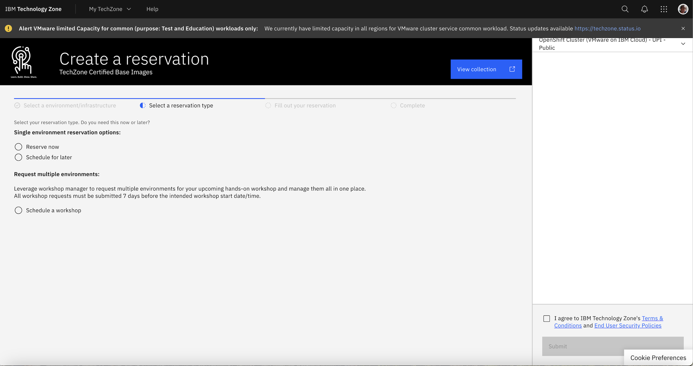

- Specify that you want to **Reserver now**.
- On the next page, you have to specify the purpose. Select **Education**.  
  Provide a **Purpose description**.  
  Select a **Preferred Geography**: it is the datacenter where your virtual machine will be provisioned. Choose a datacenter as near from you as possible.
- Scroll down the page and specify the cluster specifications:

- Openshift version: 4.16
- Worker node count: 5
- Worker node flavor: 32 vCPU x 128GB - 300 GB ephemeral storage
- Storage: Managed NFS - 2TB

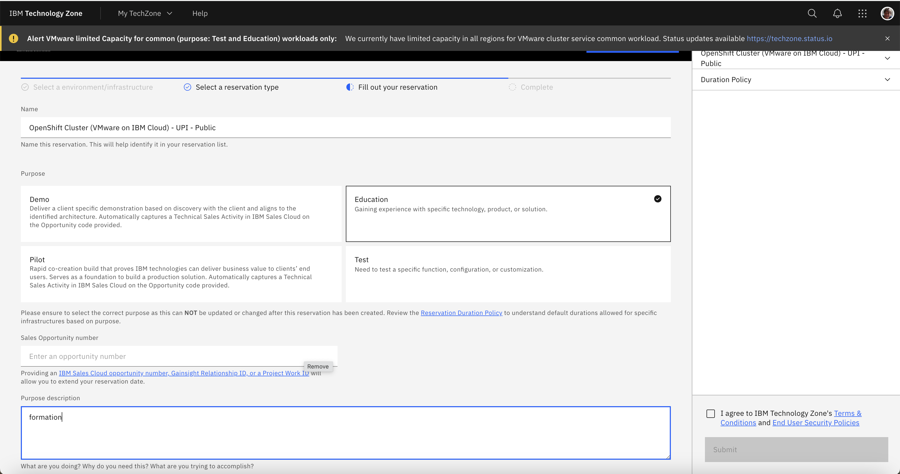
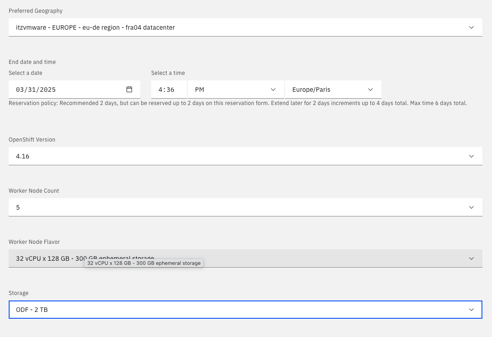

- Click **Submit**.

- You will receive a **confirmation mail** with the status **provisioning**.
  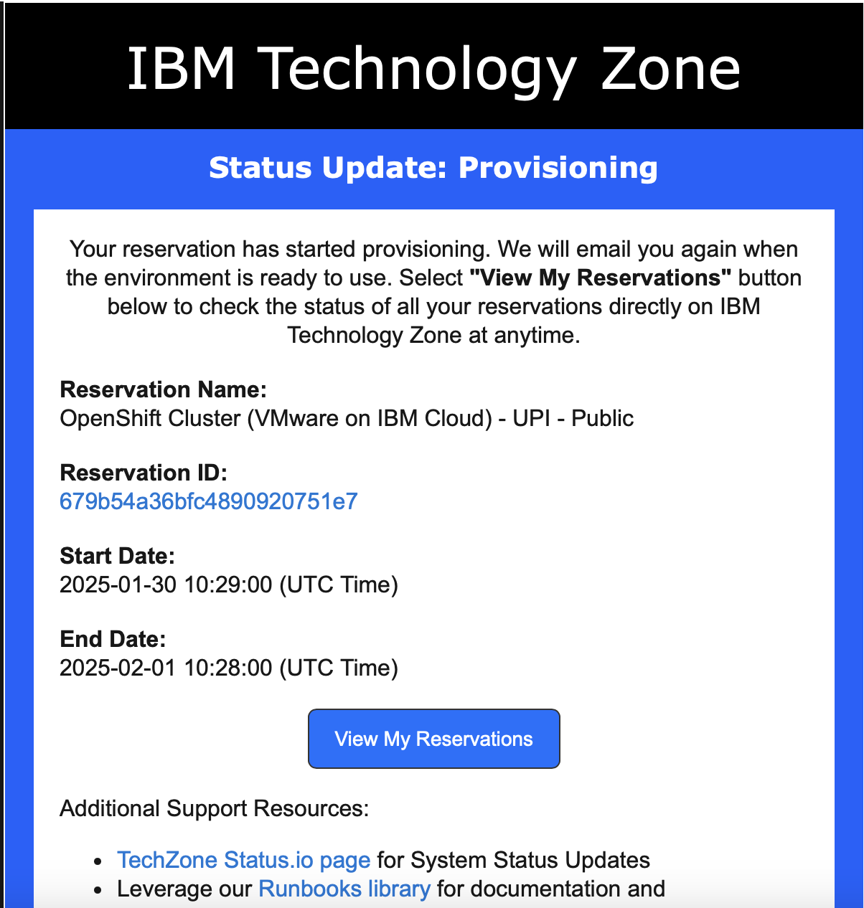

- You can also see the reservation status from your account, in **My Reservations**.
  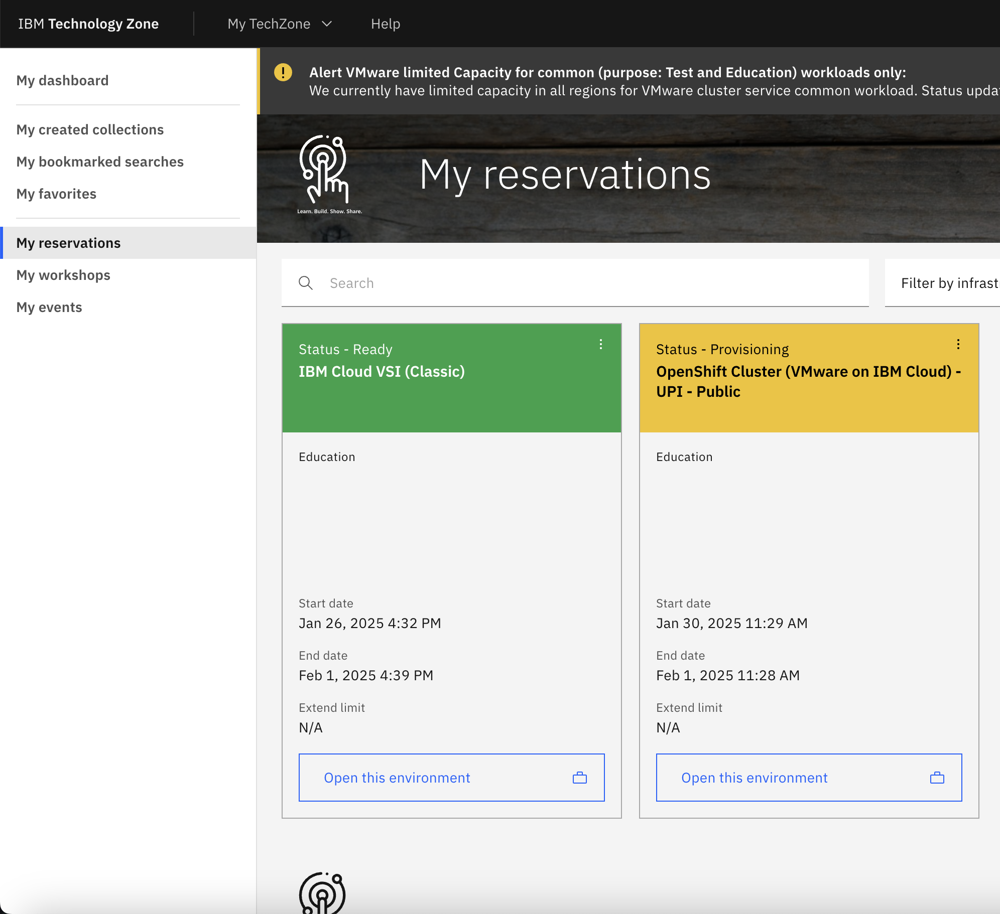

### Connecting to the Openshift Cluster

- Once the virtual machine is provisioned, you will receive a mail will the **Ready** status.
- By clicking the link **View my reervations** in the mail or from your account , in **My Reservations**, you can see your reservation with the **Ready** status.
- By clicking the **Open this environment** button, you will access all the information required to connect to the cluster
- Scroll down to the end of your page, in the **Reservation Details** section, you have (circled in orange in below screen capture)

  - OCP Console URL
  - Cluster Admin Username
  - Cluster Admin Password

    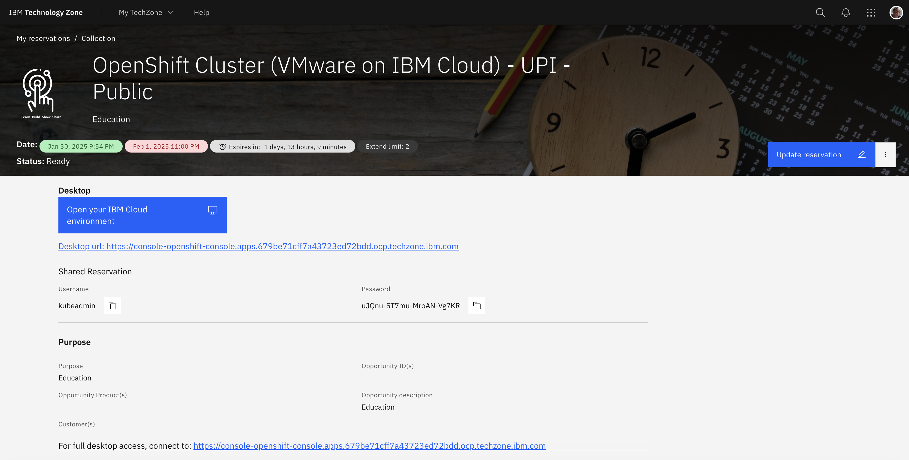
    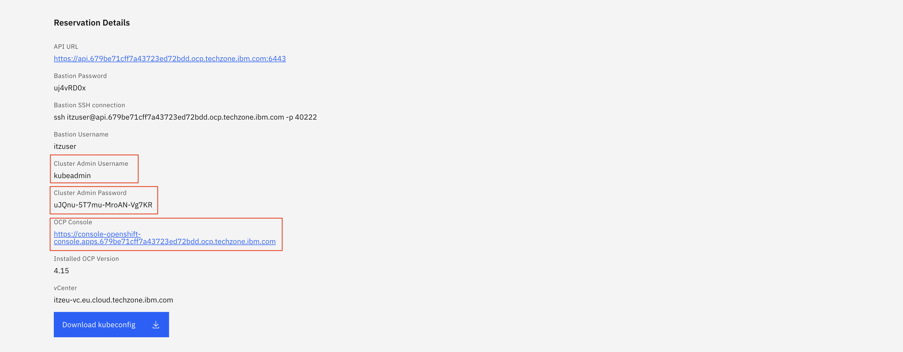

- You can then connect and authenticate to the cluster by clicking the OCP Console URL
- On the ocp console login page, select kube:admin
  <br>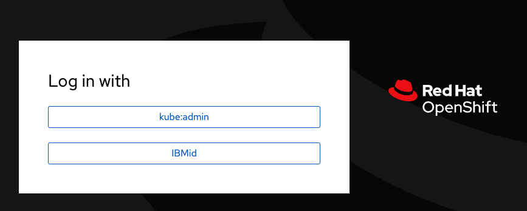
- Enter **Cluster Admin Username** and **Cluster Admin Password**
  <br>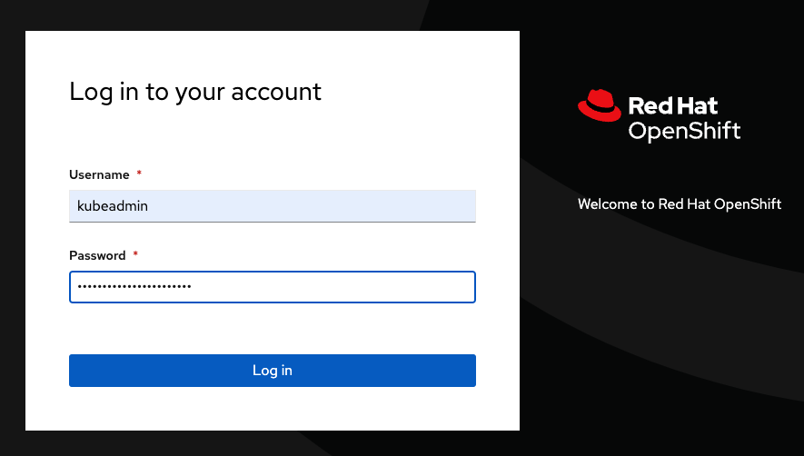

### Connecting to bastion

In order to connect to the bastion, you must use the informations circled in green in previous screen capture)

```bash
ssh itzuser@<cluster API address> -p 40222
```

Install HELM

```bash
wget https://developers.redhat.com/content-gateway/file/pub/openshift-v4/clients/helm/3.15.4/helm-linux-amd64
chmod 755 helm-linux-amd64
sudo mv helm-linux-amd64 /usr/local/bin/helm
```

### II - Provision a vm on techzone

## VM Installation

### Provision VM from techzone

VM - 16 vCPUs/32GB RAM/512GB Disk

### Prepare VM disk

logon in VM

```bash
ssh itzuser@169.44.147.111 -p 30288
sudo -i
mkfs.ext4 -m 0 -E lazy_itable_init=0,lazy_journal_init=0,discard /dev/vdc
blkid | grep /dev/vdc

mkdir -p /mnt/concert
chmod 777 /mnt/concert

cp /etc/fstab /etc/fstab.orig
vi /etc/fstab
```

insert: UUID=6b6320a6-f7cb-45fa-9fc1-6aaedeeb8e18 /mnt/concert ext4 discard,defaults,nofail 0 0

```bash
mount -a
systemctl daemon-reload
lsblk
```

### install podman

```bash
sudo dnf install podman
sudo sysctl user.max_user_namespaces=15000
sudo usermod --add-subuids 200000-201000 --add-subgids 200000-201000 itzuser
```

### III - Provision a watsonx.ai on techzone

#### Watsonx.ai Provisioning

1. Navigate to [watsonx.ai on IBM Techzone](https://techzone.ibm.com/my/reservations/create/64b8490a564e190017b8f4eb)

2. Make a reservation for IBM watsonx.ai and choose **AMERICAS** as preferred geography (at the time we write this lab, only this region has the model used by IBM Concert inferences)

3. When the reservation is ready, you should receive a mail from **IBM Cloud** to join an account in IBM Cloud.

4. Open the mail, click the **join now** link and follow the instructions.

<br>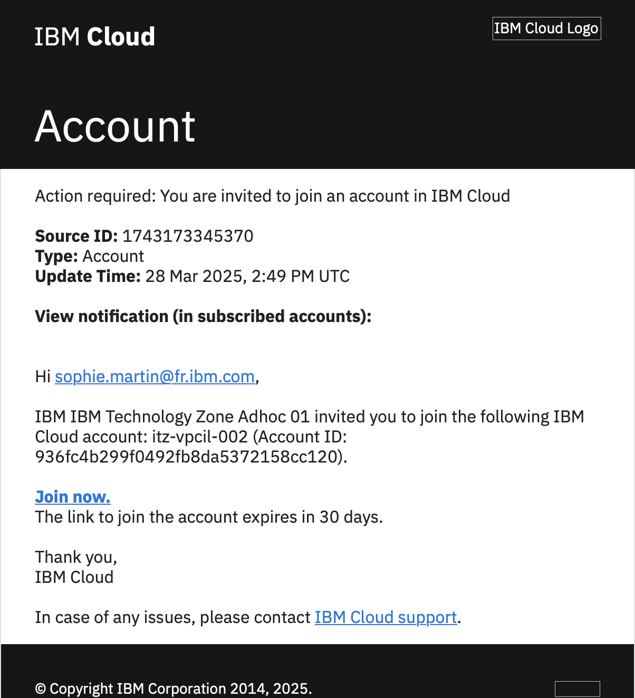

5. When you have the IBM Cloud first screen, verify that you have the good account selected on the top bar

<br>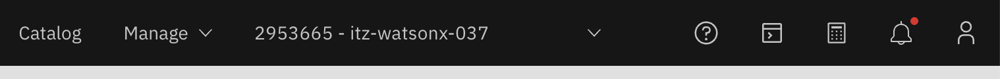

#### Create a watsonx project and get project ID

1. Select watsonx to from the burger menu on the left

<br>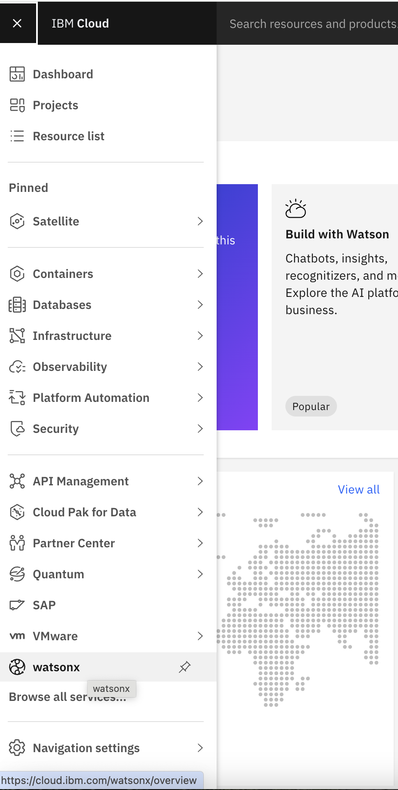

2. Click Launch in the watsonx.ai tile

<br>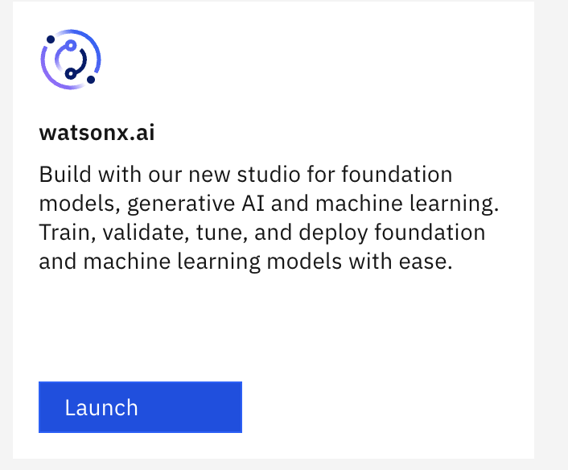

3. Scroll down in the page that appear and click **Create a sandbox project** in the Projects tile

<br>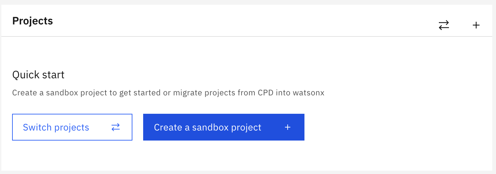

4. Select the sandbox that have been created

<br>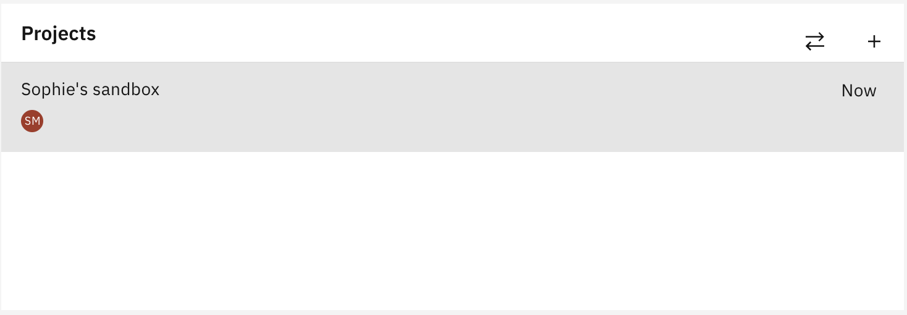

5. In manage tab, copy the "Project ID" and store it somewhere

<br>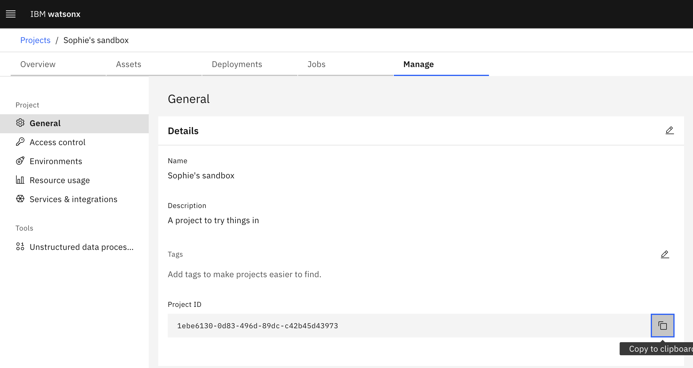

#### Get API Key and service ID information

1. From your techzone reservation screen, retrieve the APIKey and the service ID and store them somewhere

<br>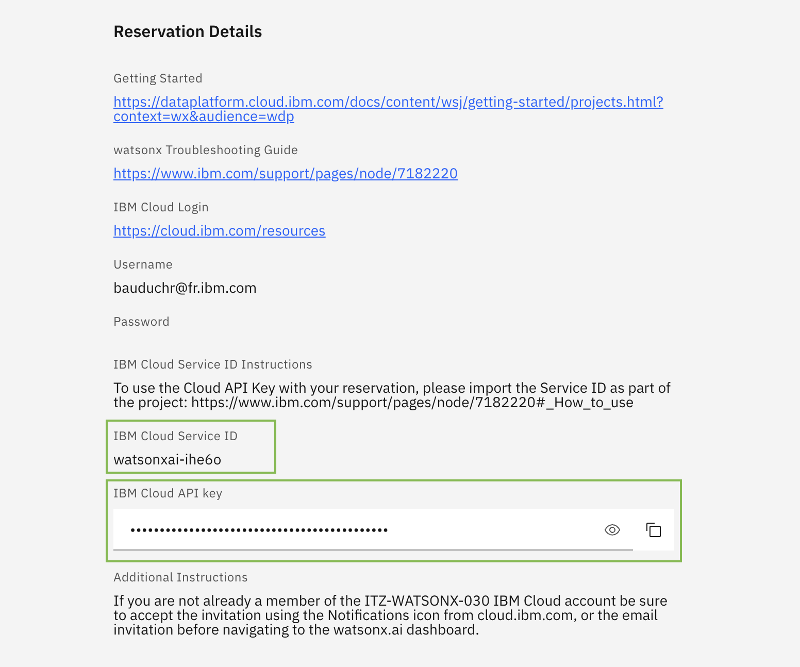

#### API key - import the Service ID as part of the project

1. From your watsonx screen, in the **manage** tab, select **Access control** in the left menu

<br>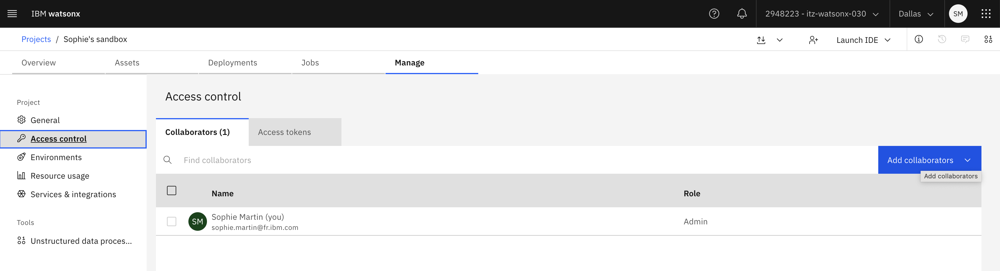

2. Click the **Add Collaborators** button and select **Add Access Group**.

<br>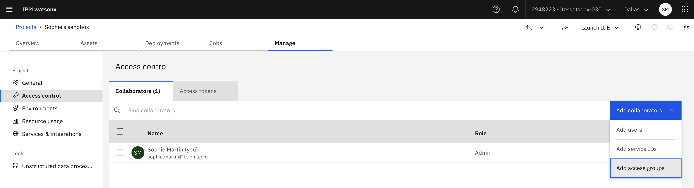

3. Enter your Access Group name (you can find your access group name under environment on your reservation page).

<br>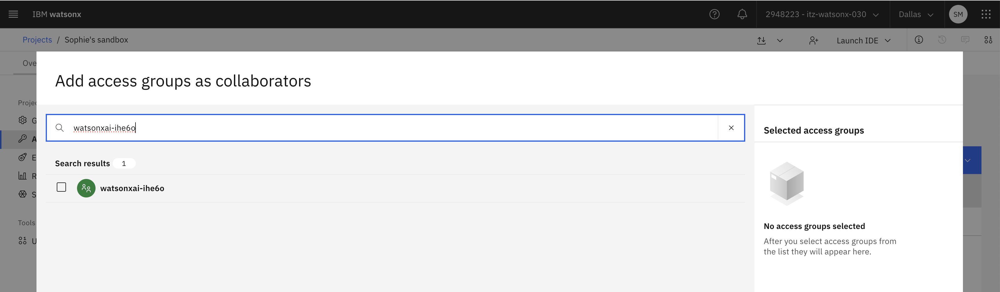

4. Give admin right to your access group

<br>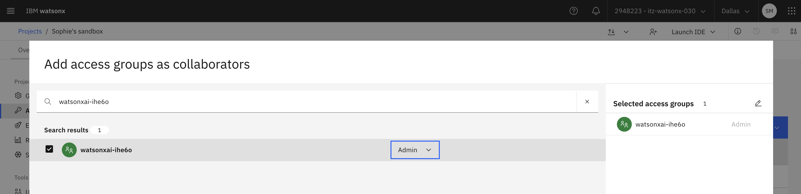
