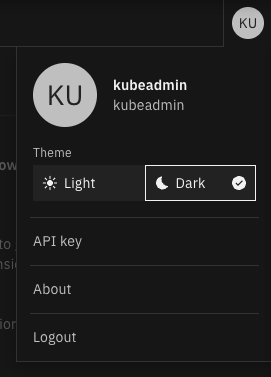

# Concert installation

- [Concert installation](#concert-installation)
  - [Objective](#objective)
  - [Prerequisite](#prerequisite)
  - [I - Install concert on an openshift cluster](#i---install-concert-on-an-openshift-cluster)
  - [II - Install IBM Concert workflow](#ii---install-ibm-concert-workflow)
  - [III - Integrate IBM Concert with watsonx.ai](#iii---integrate-ibm-concert-with-watsonxai)
    - [Techzone reservation](#techzone-reservation)
    - [Configure watsonx.ai in IBM Concert](#configure-watsonxai-in-ibm-concert)

## Objective

In this lab, you will install IBM Concert on an Openshift Cluster.

## Prerequisite

You must have run before the [Lab0](LabO-setup.md) which explain how to reserve an Openshift cluster on Techzone.

## I - Install concert on an openshift cluster

You can install concert on a VM or in a kubernetes cluster. In this lab we will do an Openshift cluster installation.

> Offcial documentation [Openshift installation](https://www.ibm.com/docs/en/concert?topic=environment-installing-concert-software-ocp-without-cpfs)

1. Connect on the bastion attached to the openshift you have created in Techzone in Lab0

You can retreive the connections information on your reservation page as explain in Lab0

```bash
ssh itzuser@<cluster API address> -p 40222
```

2. Get concert installation files

```bash
wget https://github.com/IBM/Concert/releases/download/v1.0.5.2/ibm-concert-k8s.tgz
tar xfz ibm-concert-k8s.tgz
```

3. Create a $HOME/env.sh file

```bash
vi $HOME/env.sh
```

Copy Paste the content of [env-ocp.sh](../files/env-ocp.sh) in this $HOME/env.sh file  
Update the values for the following keys (other keys will be updated later):

- ENTITLEMENT_API_KEY with your [entitlement key](https://www.ibm.com/docs/en/concert?topic=concert-obtaining-entitlement-api-key)
- CLUSTER_USER with your cluster username
- CLUSTER_PASSWORD with your cluster password
- CLUSTER_STORAGE_CLASS with the cluster storage class you will use (ex: ocs-storagecluster-cephfs)

Save the file (:wq) and source the $HOME/env.sh file to set environment variables

```bash
source $HOME/env.sh
```

4. Then install IBM Concert

```bash
cd ibm-concert-k8s

./install-concert-k8s \
--license_acceptance=y \
--namespace=$CONCERT_NAMESPACE \
--registry=cp.icr.io/cp/concert \
--registry_user=cp \
--registry_password=$ENTITLEMENT_API_KEY \
--username=$CLUSTER_USER \
--password=$CLUSTER_PASSWORD \
--storage_class=$CLUSTER_STORAGE_CLASS \
--scale_config=level_1
```

Wait until the end of the installation

5. The last step is to create a route to reach the IBM Concert GUI

- Generate a route to access Concert on your OCP cluster

```bash
./ocp-route.sh $CONCERT_NAMESPACE
```

- Retrieve the route created in the previous step

```bash
oc get route concert -n $CONCERT_NAMESPACE
```

6. Connect on Concert and create an API Key

- From a browser go to the Concert route. For example https://concert-concert.apps.67e805b7800781b10c12649c.ocp.techzone.ibm.com
- Log on concert using your cluster credentials (kubeadmin user)
- Click the KU circle at top right of the window and select **API Key**
  <br>
- In the API Key window, click **Generate API Key**
  <br>
- Copy the API key generated in your clipboard

7. Update environment variables

```bash
vi $HOME/env.sh
```

Update the values for the following keys:

- CONCERT_URL with the Concert route (ex: https://concert-concert.apps.67e805b7800781b10c12649c.ocp.techzone.ibm.com)
- CONCERT_APIKEY with the API Key you created in step 6.

Save the file (:wq) and source the $HOME/env.sh file to set environment variables

```bash
source $HOME/env.sh
```

## II - Install IBM Concert workflow

> Offical documentation [ocp installation]https://www.ibm.com/docs/en/concert?topic=workflows-installing-concert-ocp)

1. Connect on the bastion attached to the openshift you have created in Techzone in Lab0

```bash
ssh itzuser@api.67e79222561226085c8b191c.ocp.techzone.ibm.com -p 40222
oVpEFHPM
```

2. Get concert workflow installation files

```bash
cd $HOME
wget https://github.com/IBM/Concert/releases/download/v1.0.5.2/ibm-concert-k8s-workflows.tgz
tar xfz ibm-concert-k8s-workflows.tgz
```

4. Get concert infos and generate CONCERT_HUB_KEY

```bash
cd workflows

./bin/tethering/get_concert_info.sh \
--concert-url=$CONCERT_URL \
--c-api-key=$CONCERT_APIKEY
```

Copy the 3 last lines returned somewhere

5. Update environment variables

```bash
vi $HOME/env.sh
```

Update the values for the following keys:

- CONCERT_HUB_KEY with the value returned by get_concert_info.sh in step 4.
- WORKFLOW_APIKEY with the value returned by get_concert_info.sh in step 4.

Save the file (:wq) and source the $HOME/env.sh file to set environment variables

```bash
source $HOME/env.sh
```

6.Edit the concert-workflows-values.yaml located in the /home/itzuser/workflows/bin folder:

```bash
sudo vi /home/itzuser/workflows/bin/concert-workflows-values.yaml
```

- Set **address** to the IP address of your cluster (you can do a ping to its url to retrieve it) OR concert route ????
- Set **CONCERT_HUB_URL** to the CONCERT_HUB_URL value return by get_concert_info.sh in step 4.
- Set **CONCERT_HUB_KEY** to the CONCERT_HUB_KEY value return by get_concert_info.sh in step 4.
- Add a new variable **CONCERT_API_KEY** under **CONCERT_HUB_KEY** and set its value to your CONCERT_APIKEY (in $HOME/env.sh file)
- save your file (:wq)

7. Create the concert workflow namespace

```bash
oc create namespace $CW_NAMESPACE
```

8. Create a secret called ibm-entitlement-key in the same namespace

```bash
oc create secret docker-registry ibm-entitlement-key \
--docker-server=$CONCERT_REGISTRY \
--docker-username=$CONCERT_REGISTRY_USER \
--docker-password=$CONCERT_REGISTRY_PASSWORD \
--namespace="$CW_NAMESPACE"
```

9. Install concert worflow

```bash
cd /home/itzuser/workflows
./bin/deploy-k8s --namespace="${CW_NAMESPACE}"
```

Wait until the end of the installation

10. Update environment variables

```bash
vi $HOME/env.sh
```

Update the values for the following keys:

- CONCERT_HUB_URL with the Concert route (same as CONCERT_URL)
- EXT_URL to the IP address of your cluster
- EXTNS_DIR with /home/itzuser/workflows/extns/

Save the file (:wq) and source the $HOME/env.sh file to set environment variables

```bash
source $HOME/env.sh
```

11. Register Concert Workflows as an add-on to your Concert instance.

```bash
./bin/tethering/tether-to-hub.sh \
--concert-hub-url="$CONCERT_HUB_URL" \
--concert-hub-key="$CONCERT_HUB_KEY" \
--extn-dir=$EXTNS_DIR \
--provider=$ADDON_NAME \
--target-ns="${CW_NAMESPACE}"
```

12. Establish authentication credentials and a reusable connection for Concert Workflows

```bash
chmod +x bin/tethering/enable_concert_workflows.sh
./bin/tethering/enable_concert_workflows.sh --concert-url="$CONCERT_HUB_URL" --c-api-key="$CONCERT_APIKEY" --c-user="$CONCERT_USER" --workflow-apikey="$WORKFLOW_APIKEY"
```

## III - Integrate IBM Concert with watsonx.ai

> !!!! Concert require model ibm/granite-3-2-8b-instruct on x.ai !!!!

### Techzone reservation

Be sure to reserve a watsonx.ai instance as explained in [Lab 0 - III - Provision a watsonx.ai on techzone](Lab0-setup.md#iii---provision-a-watsonxai-on-techzone).

### Configure watsonx.ai in IBM Concert

The watsonx.ai integration is simply done through setting some config parameters in the config files of IBM concert.

You will need to update the $HOME/env.sh file.

```
vim $HOME/env.sh
```

Update the following variables:

- WATSONX_API_KEY: use the API key you got in [Lab 0 - Get API Key and service ID information](Lab0-setup.md#get-api-key-and-service-id-information), from your techzone wx.ai reservation page
- WATSONX_API_PROJECT_ID: use the project ID you got from [Lab 0 - Create a watsonx project and get project ID](Lab0-setup.md#create-a-watsonx-project-and-get-project-id),
- WATSONX_API_URL: https://us-south.ml.cloud.ibm.com , since the instance is provision is US.

For a OCP based installation the parameters must be set in the configuration secret.
This can be done in the following way:

```
source $HOME/env.sh

kubectl patch secret/app-cfg-secret -n $CONCERT_NAMESPACE --type=merge -p '{
  "data": {
    "WATSONX_API_KEY": "'$(echo -n $WATSONX_API_KEY | base64 )'",
    "WATSONX_API_PROJECT_ID": "'$(echo -n "$WATSONX_API_PROJECT_ID" | base64 )'",
    "WATSONX_API_URL": "'$(echo -n "$WATSONX_API_URL" | base64 )'"
  }
}'
kubectl rollout restart -n $CONCERT_NAMESPACE deployment/roja-py-utils
```
