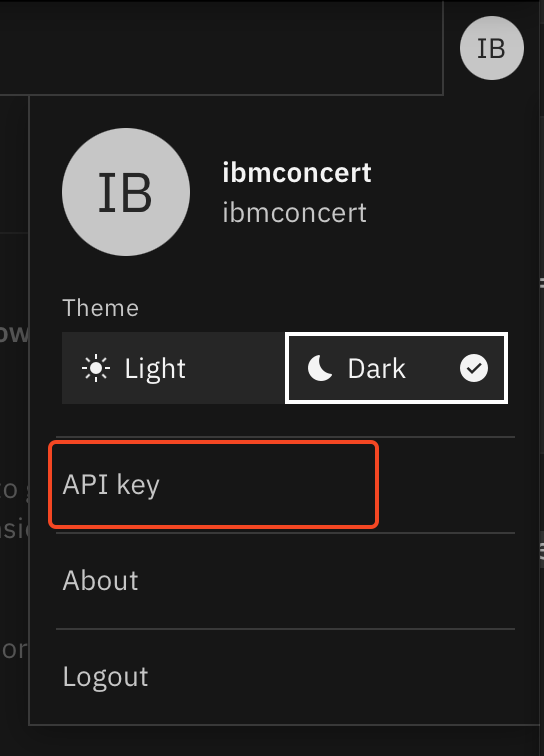

# IBM Concert installation on a virtual machine

## Objective

In this lab, you will install IBM Concert on a standalone server.

## Prerequisite

- An virtual machine must have been provisionned on Techzone and configured as explained in [Lab0](./Lab0-setup.md)

## Content

- [IBM Concert installation on a virtual machine](#ibm-concert-installation-on-a-virtual-machine)
  - [Objective](#objective)
  - [Prerequisite](#prerequisite)
  - [Content](#content)
  - [I - Installing IBM Concert on a VM](#i---installing-ibm-concert-on-a-vm)
  - [II - Watsonx.ai integration](#ii---watsonxai-integration)
    - [Techzone reservation](#techzone-reservation)
    - [Configure watsonx.ai in IBM Concert](#configure-watsonxai-in-ibm-concert)
  
## I - Installing IBM Concert on a VM

> Official documentation [VM installation](https://www.ibm.com/docs/en/concert?topic=concert-deploying-virtual-machine-vm)

1. Connect on the machine you have provisioned on Techzone in Lab0

```bash
ssh itzuser@<VM ip address> -p 2223 -i /path/to/concert/sshkey/pem_ibmcloudvsi_download.pem
loginctl enable-linger itzuser
cd /mnt/concert
wget https://github.com/IBM/Concert/releases/download/v1.0.5.4/ibm-concert-std.tgz
tar xfz ibm-concert-std.tgz
```

2. Create a $HOME/env.sh file

```bash
vi $HOME/env.sh
```

Copy Paste the content of [env.sh](../files/env.sh) in this $HOME/env.sh file  
Update the values for the following keys (other keys will be updated later):

- CONCERT_REGISTRY_PASSWORD with your [entitlement key](https://www.ibm.com/docs/en/concert?topic=concert-obtaining-entitlement-api-key)
- CONCERT_HUB_URL with your VM address
- EXT_URL with your VM address

3. Source the $HOME/env.sh file to set environment variables

```bash
source $HOME/env.sh
```

4. Install concert

```bash
${DOCKER_EXE} login ${CONCERT_REGISTRY} --username=${CONCERT_REGISTRY_USER} --password=${CONCERT_REGISTRY_PASSWORD}
ibm-concert-std/bin/setup --license_acceptance=y --registry=${CONCERT_REGISTRY} --runtime=${DOCKER_EXE} --username=ibmconcert --password
```

The installer will prompt for a password.  
This will define the default password for the GUI user `ibmconcert`

5. Connect on Concert and create an API Key

- From a browser go to the Concert route (https://VMaddress:12443)
- Log on concert using **ibmconcert** as user and with the password you have specified in step 4.
- Click the circle at top right of the window and select **API Key**
  <br>
- In the API Key window, click **Generate API Key**
  <br>
- Copy the API key generated in your clipboard

7. Update environment variables

```bash
vi $HOME/env.sh
```

Update the values for the following keys:

- CONCERT_URL with https://VMaddress:12443 (replace VMaddress with you own VM address)
- CONCERT_APIKEY with the API Key you created in step 5.

Save the file (:wq) and source the $HOME/env.sh file to set environment variables

```bash
source $HOME/env.sh
```

## II - Watsonx.ai integration

> !!!! Concert require model ibm/granite-3-2-8b-instruct on x.ai !!!!

### Techzone reservation

Be sure to reserve a watsonx.ai instance as explained in [Lab 0 - III - Provision a watsonx.ai on techzone](Lab0-setup.md#iii---provision-a-watsonxai-on-techzone).

### Configure watsonx.ai in IBM Concert

The watsonx.ai integration is simply done through setting some config parameters in the config files of IBM concert.  

1. You will need to update the $HOME/env.sh file.
```bash
vim $HOME/env.sh
```

Update the following variables:
- **WATSONX_API_KEY**: use the API key you got in [Lab 0 - Get API Key and service ID information](Lab0-setup.md#get-api-key-and-service-id-information), from your techzone wx.ai reservation page
- **WATSONX_API_PROJECT_ID**: use the project ID you got from [Lab 0 - Create a watsonx project and get project ID](Lab0-setup.md#create-a-watsonx-project-and-get-project-id),
- **WATSONX_API_URL**: https://us-south.ml.cloud.ibm.com , since the instance is provision is US.

2. Apply the watsonx.ai configuration

```bash
echo "WATSONX_API_KEY=$WATSONX_API_KEY" >> ibm-concert-std/etc/local_config.env
echo "WATSONX_API_PROJECT_ID=$WATSONX_API_PROJECT_ID" >> ibm-concert-std/etc/local_config.env
echo WATSONX_API_URL=$WATSONX_API_URL >> ibm-concert-std/etc/local_config.env
```

3. Then you need to start the appropriate service:

```bash
cd /mnt/concert
source $HOME/env.sh
ibm-concert-std/bin/start_service ibm-roja-py-utils
```
