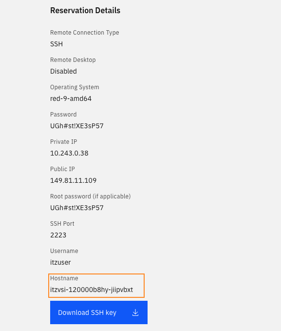
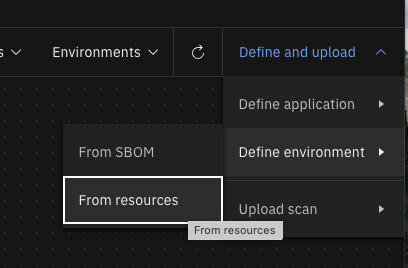
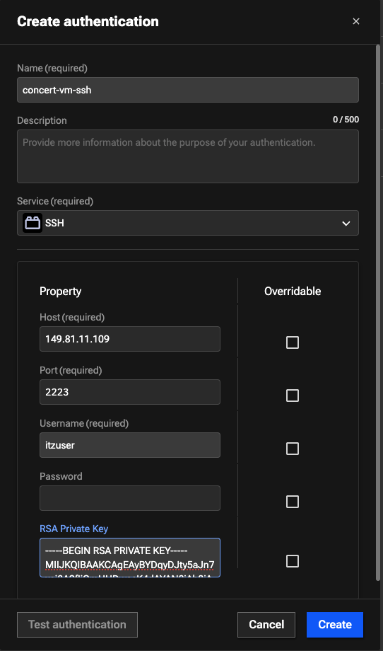
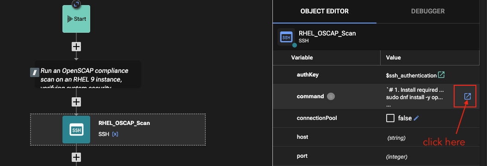
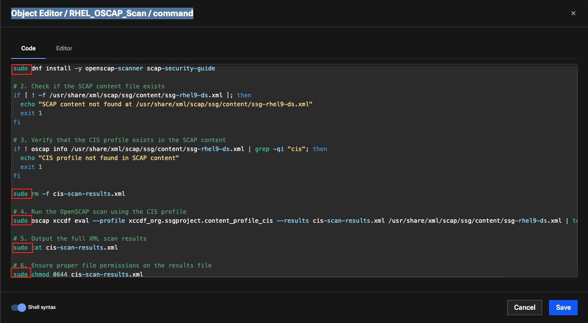
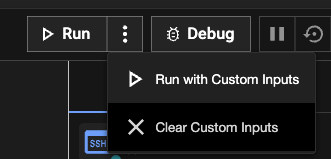
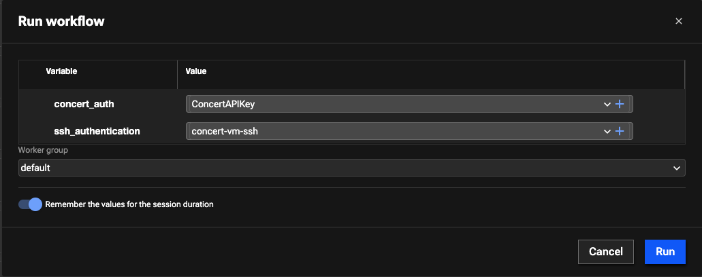
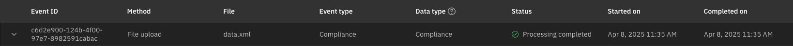
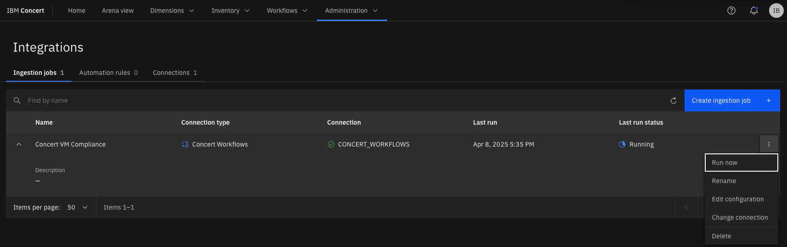
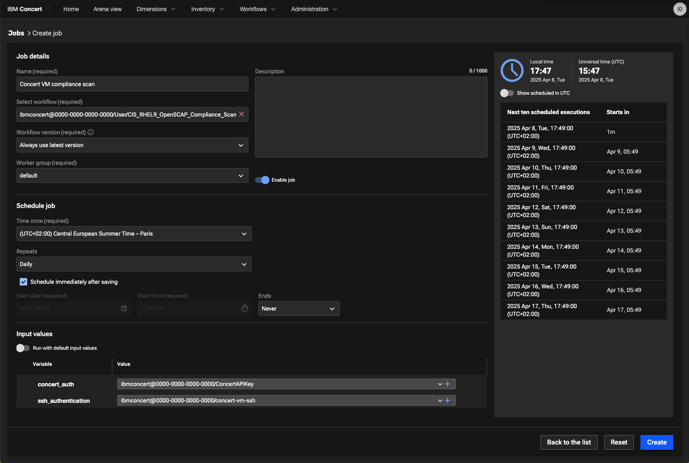

# Managing Compliance

## Objective

In this lab, you will use concert workflow to ingest compliance data from a rhel vm in IBM Concert. We will use your VM concert as the target of the compliance job.

## Prerequisite

- IBM Concert must be installed
- Concert workflow must be installed
  
## Content

## Run compliance workflow

> Offical documentation: https://www.ibm.com/docs/en/concert?topic=cd-using-concert-workflows-generate-import-cis-rhel9-openscap-compliance-scan

The **CIS RHEL9 OpensSCAP Compliance Scan** workflow  automates the CIS compliance scan for RHEL 9 using OpenSCAP. In order to be able to ingest compliance data in IBM Concert, you must have an environment defined in IBM Concert with the hostname of the machine that will be scanned.

#### Create an environment 

1. From your VM Rhel 9 reservation page, get the VM hostname.
   

2. From the arena view on your concert UI, select** Define and upload->Define Environment->From resources**
   

3. In the **Define an environment** screen, enter following informations:

- name: your VM hostname
- type: other
- purpose: what you want

Then click **next**, **next** and **Create**

### Install the workflow in IBM Concert

1. Download the **CIS RHEL9 OpensSCAP Compliance Scan** worflow from the [Automation Library](https://automation-library.ibm.com/workflows/CIS%20RHEL9%20OpenSCAP%20Compliance%20Scan)

2. Upload the workflow in concert 

- On concert UI, select **Workflows->Manage** menu
- Select **Import** button
- And choose the zip file corresponding to the workflow you downloaded in step1 (name CIS_RHEL9_OpenSCAP_Compliance_Scan.zip)
   
### Create an Authentication to ssh the Concert VM

1. On concert UI, select **Workflows->Authentications** menu 
2. Click the **Create authentication** button and enter following informations:

- name: concert-vm-ssh
- service: SSH
- Host: your VM Ip public address (from your reservation page)
- Port: 2223
- Username: itzuser
- RSA Private Key: the content of your VM pem key (downloaded from your reservation page)

   

### Run manually the workflow

1. On concert UI, select **Workflows->Manage** menu 
2. Select **CIS_RHEL9_OpenSCAP_Compliance_Scan** workflow
3. Edit the RHEL_OSCAP_Scan step

   

5. Add a sudo before each commands and save your modifications

   

6. Execute the worflow

- Select **Run->Run with Custom Inputs**, select the authentication entries and click run

   
   

> Note: You can also run the workflow in debug mode. In this case you must give the authentication values in the workflow Start box

7. Check the ingested data

- When the workflow is finished, navigate to **Administration->Event log** menu and check that the compliance file upload is successfull
   

- Navigate to **Dimensions->Compliance** menu and consult the result of your concert VM imported compliance data

### Run the workflow from an ingestion job

You can create an ingestion job to run the compliance scan

1. Navigate to the **Administration->Integrations** menu
2. Click **Create ingestion job** button
3. Enter following values and click Create

- Name: Concert VM Compliance
- Connection type: Concert Workflows
- Connection: CONCERT_WORKFLOWS
- Workflow reference: /User/CIS_RHEL9_OpenSCAP_Compliance_Scan
- Concert auth: ibmconcert@0000-0000-0000-0000/ConcertAPIKey
- Ssh authentication: ibmconcert@0000-0000-0000-0000/concert-vm-ssh

4. Then you can launch the job

   

> Note: you need to reload the page to see if the job is finished

### Scheduling the workflow job

Alternatively, you can also schedule a workflow job for ingestion of compliance scans into Concert if needed.

1. Navigate to **Workflows->Schedule** menu
2. Select **Create job** button
3. Populate the values and click **Create**

   

## Compliance Management

TO DO
