# Managing Compliance

## Objective

In order to use resilience Lens, the client need to determine the non-functional requirements (NFRs) that apply to its applications, as well as the target values that must be achieved to meet contractual obligations or otherwise be considered resilient. Also, relevant data must be collected from the applications and their environment components in order to import them to Concert on a regular basis.

In this lab, you will use and create a concert workflow to ingest resilience data concerning the quality of docker images in IBM Concert. We will use the 2 images that you have build in lab4.

## Prerequisite

- IBM Concert must be installed
- Concert workflow must be installed
  
## Content

- [Managing Compliance](#managing-compliance)
  - [Objective](#objective)
  - [Prerequisite](#prerequisite)
  - [Content](#content)
  - [Import Resilience data using a workflow](#import-resilience-data-using-a-workflow)
    - [Import a resilience library](#import-a-resilience-library)
    - [Define resilience profiles](#define-resilience-profiles)
    - [Import a resilience workflow](#import-a-resilience-workflow)
    - [Build your own workflow](#build-your-own-workflow)
    - [Complete the resilience workflow previously imported](#complete-the-resilience-workflow-previously-imported)
    - [Run the workflow to populate you application resilience posture](#run-the-workflow-to-populate-you-application-resilience-posture)
  - [Resilience Management](#resilience-management)

## Import Resilience data using a workflow

### Import a resilience library

WAIT FOR MATHIEU INPUTS

### Define resilience profiles

WAIT FOR MATHIEU INPUTS

### Import a resilience workflow

You will start to import a pre-defined workflow available [here](../files/workflows_lab7/docker_images_metrics.zip).   

1. From Concert UI, navigate to **Workflows->Manage**
2. Navigate in **Shared->Everyone** folder
3. Create a folder called **Resilience** by clicking **Create folder**
   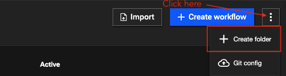
4. Navigate in the **Resilience** folder you just create
5. Click the **Import** button (top right of the window) and select the **docker_images_metrics.zip** workflow from your laptop

This workflow get the hr-application images you have build in Lab4 from your concert VM. Then, for each images it will do a 'podman inspect' and calculate 2 metrics: the average number of layers per images and the percentage of images with a 'latest' tag.   

To be able to ssh you concert VM, you need to define an SSH Authentication:

1. Navigate to **Workflows->Authentications**
2. Click the **Create authentication** button (top right of the window)
3. Call it **dev-vm**
4. In Service, select **SSH**
5. Then enter these values:

- **Host**: your Concert VM IP
- **Port**: 2223
- **Username**: itzuser
- **RSA Private Key**: the content of the pem file you download from your reservation page

   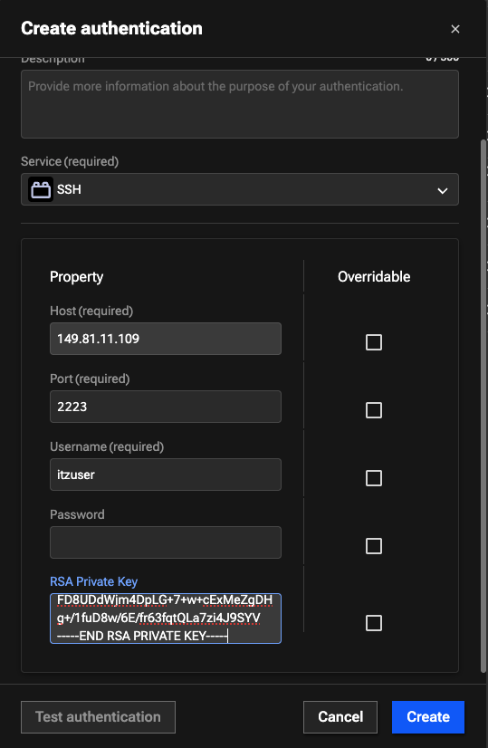

### Build your own workflow

You will now create a workflow that will be used as a sub-worflow of **docker_images_metrics** worflow in order to define a new metric: the percentage of big image.
The aim of this workflow is to extract the image size from a json object that have the format of the result of the 'podman inspect' command

1. From Concert UI, navigate to **Workflows->Manage**
2. Navigate in **Shared->Everyone->Resilience** folder
3. Click the button **Create workflow** (top right of the window)
4. Call it **docker_images_size**
5. Define your variables:

| Name          |    Type       | Default Value  |Selected box    |
| :------------ | :-------------| :------------- | :-------------: |
| json_inspect  | Array         | [{"Architecture": "amd64", "Os": "linux", "Size": 1378729490}] | in / required |
| image_size    | Number        | 0                                                            | out / log     |

Then you are going to use a "jq" node in order to extract the size from the **json_inspect** input variable:

1. From the palette that is at the left pane of your window, navigate in **Common->Json**
2. Select the **jq** box and drag and drop it before the **Assign_1** box
      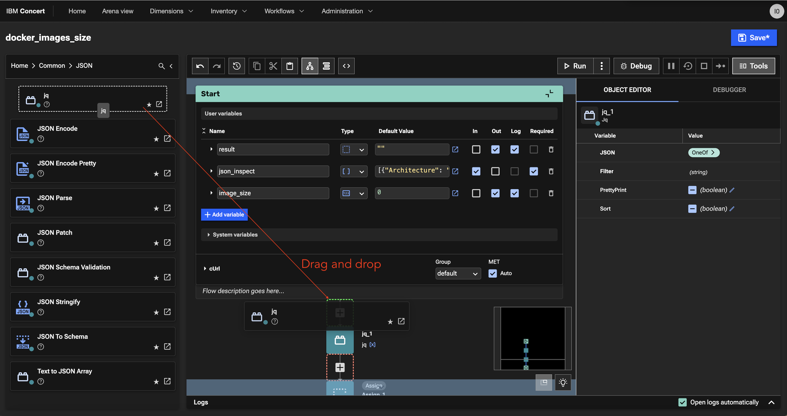

3. From the **Object Editor** that is in the right pane of your window, click on **OneOf>**
     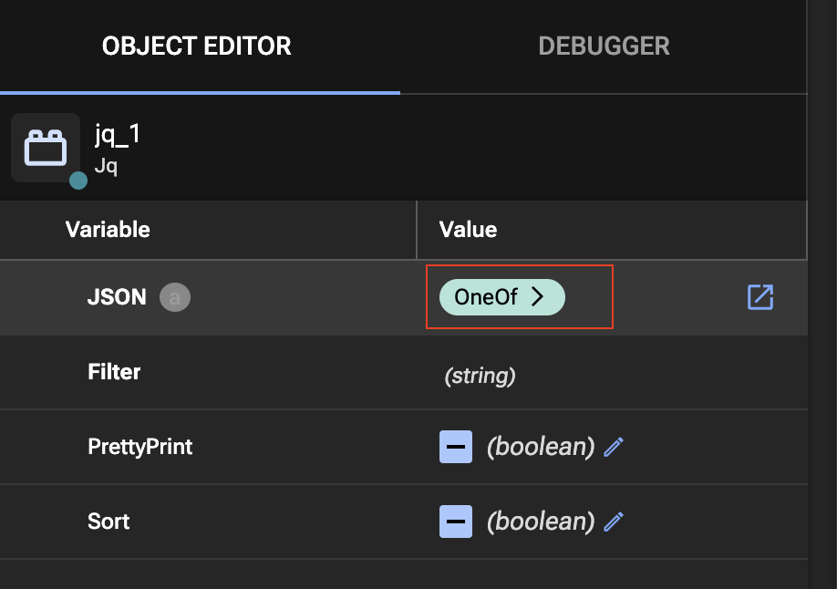

4. Select **Array**, Click **OK** and Click **Cancel**    
     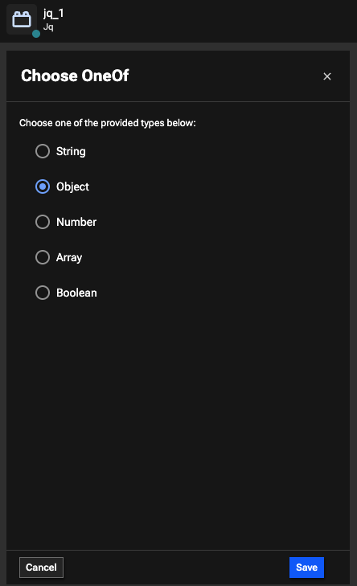

5. Then select the pencil to set the JSON variable that jq will use as input
     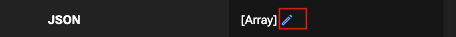
   
6. Enter value: $json_inspect
7. For the Filter variable put the value: ".[].Size"
     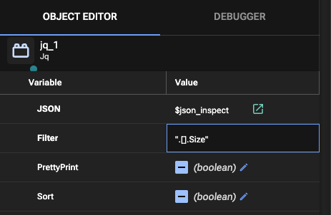

You just need now to assign the result of the jq node in the **image_size** output variable of your flow

1. Select the **Assign** node that is under the **jq** node
2. From the **Object Editor** that is in the right pane of your window, enter following values:

- **variable**: $image_size
- **value**: $jq_1.result

     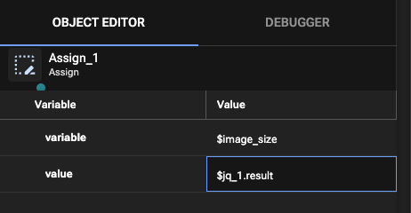

You can now test your workflow:

1. Click the Run button
     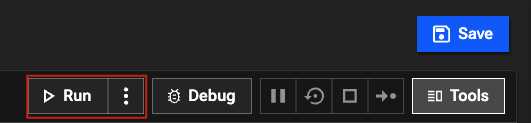

2. At the bottom of your window, you should have the image size corresponding to the value of your **json_inspect** input variable displayed

     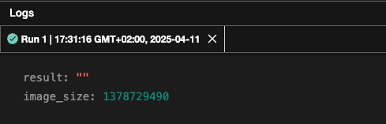

### Complete the resilience workflow previously imported

You are going to add a branch in the main workflow in order to add the percentage of big images metrics

1. From Concert UI, navigate to **Workflows->Manage**
2. Navigate in **Shared->Everyone->Resilience** folder
3. Open the **docker_images_metrics** workflow
4. Scroll down the workflow until the **Split_1** node and click **+BRANCH**

     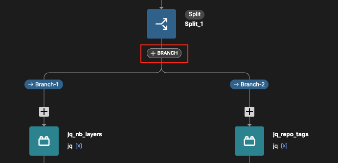

5. From the palette that is at the left pane of your window, navigate in **Common->Shared->Everyone->Resilience**
6. Drag and drop the **docker_image_size** node in your new branch
7. Name the node **get_image_size_flow**
8. From the **Object Editor** that is in the right pane of your window, enter following values:

- **json_inspect**: $ssh_inspect_image.result
  
8. Then complete your branch as shown in following image

     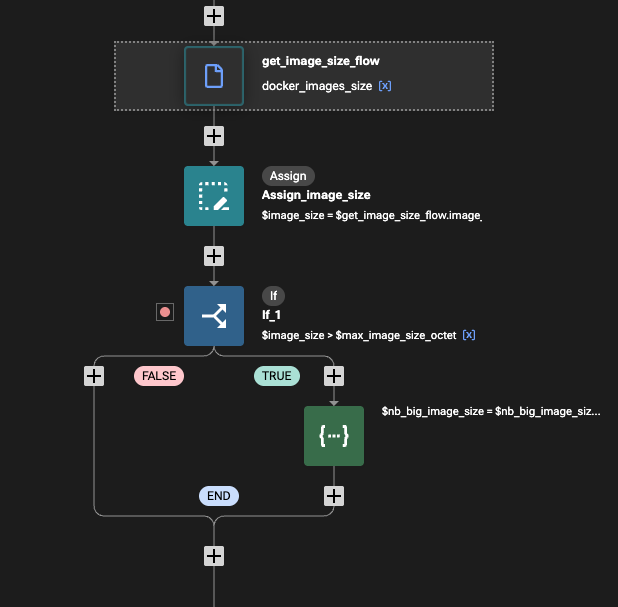

> TIPS: most common nodes can also be added by clicking the + that are in the flow where you want to add your node. 

You can test your workflow by selecting the Run button. Note that you can also run your workflow in debug if needed and put breakpoint on selected nodes.

### Run the workflow to populate you application resilience posture

Now that your flow is running and get values for our three metrics, you will add another subflow at the end to upload the resilience values in Concert.

1. Download the **upload_to_concert.zip** workflow on your laptop from [here](../files/workflows_lab7/upload_to_concert.zip)
2. From Concert UI, navigate to **Workflows->Manage**
3. Navigate in **Shared->Everyone->Resilience** folder
4. Click the **Import** button (top right of the window) and select the **upload_to_concert.zip** workflow from your laptop 
5. Open the **docker_images_metrics** workflow
6. Scroll and the end of the flow

TODO ... ADD THE UPLOAD CONCERT SUBFLOW

## Resilience Management

Walkthrough the uploaded data
